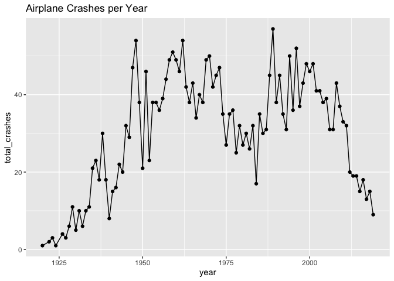

Exploring the Data
================
2025-11-18

Loading and tidying the data.

``` r
airplane_df = read_csv("datasets/airplane_crashes.csv") |> 
  janitor::clean_names() |> 
  filter(ground != "NULL", aboard != "NULL") |> 

  # removes an unnecessary column
  select(-flight_number, -fatalities_passangers, -fatalities_crew, -aboard_passangers, -aboard_crew) |> 
  drop_na(date, time, operator, route, aboard, fatalities, registration, cn_ln, ground, summary)       
```

    ## Warning: One or more parsing issues, call `problems()` on your data frame for details,
    ## e.g.:
    ##   dat <- vroom(...)
    ##   problems(dat)

    ## Rows: 4967 Columns: 17
    ## ── Column specification ────────────────────────────────────────────────────────
    ## Delimiter: ","
    ## chr (16): Date, Time, Location, Operator, Flight #, Route, AC Type, Registra...
    ## dbl  (1): Fatalities
    ## 
    ## ℹ Use `spec()` to retrieve the full column specification for this data.
    ## ℹ Specify the column types or set `show_col_types = FALSE` to quiet this message.

Creating a datetime column.

``` r
airplane_df = airplane_df |> 
  mutate(
    # remove leading/trailing spaces
    time = str_trim(time),
    
    # replace the invalid times with NA
    time = ifelse(time %in% c("91:5", "90:0"), NA, time),
    
    # combine the cleaned date and time columns into datetime
    datetime = mdy_hm(paste(date, time))
  ) |> 
  
  # remove any rows that could not be parsed
  drop_na(datetime)
```

    ## Warning: There was 1 warning in `mutate()`.
    ## ℹ In argument: `datetime = mdy_hm(paste(date, time))`.
    ## Caused by warning:
    ## !  2 failed to parse.

Converting variables to their proper variable types.

``` r
airplane_df = airplane_df |> 
  mutate(
    year       = year(datetime), 
    month      = month(datetime), 
    month_name = month(datetime, label = TRUE),
    
    aboard     = as.numeric(aboard),
    fatalities =  as.numeric(ground),
    operator   = as.factor(operator)  # to group by operator
    ) |> 
  select(datetime, year, month, month_name, everything()) |> 
  select(-date, -time)
```

## Exploring the data.

Crashes per year?

``` r
airplane_df |> 
  group_by(year) |> 
  summarize(total_crashes = n()) |> 
  ggplot(aes(x = year, y = total_crashes)) + 
  geom_line() +
  geom_point() + 
  labs(title = "Airplane Crashes per Year")
```

<!-- -->

Seasonal trends over the years?

``` r
airplane_df |> 
  group_by(month_name) |> 
  summarize(total_crashes = n()) |> 
  ggplot(aes(x = month_name, y = total_crashes)) +
  geom_col(fill = "blue") +
  labs(title = "Airplane Crashes by Month")
```

<!-- -->
